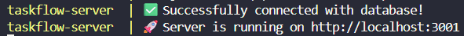
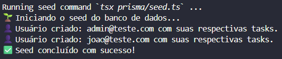

<h1 align="center">Desafio Técnico — Revelatio</h1>

<p align="center">
  Sistema de gerenciamento de tarefas em formato Kanban, desenvolvido como solução para o desafio técnico da <strong>Revelatio</strong>.
</p>

<p align="center">
  
  
  
  
  
  
  
</p>

<p align="center">
  
  
</p>

---

# ⏺️ Vídeo de Apresentação

Confira a demonstração completa das funcionalidades e uma explicação da arquitetura do projeto.

👉 **[Assistir à apresentação do projeto](https://youtu.be/W8m4bVX6Z6E?is=-mEli67vAF8seRmm)**

---

# 🏗️ Arquitetura do Monorepo

O projeto foi estruturado no formato **Monorepo**, unificando o ecossistema do **Backend** e do **Frontend** em um único repositório para facilitar o compartilhamento de tipos, scripts e gerenciamento de dependências.

```
.
├── .github
├── assets
├── client -> Frontend
└── server -> Backend

```

### /server

Backend desenvolvido com:

- Node.js
- Express
- Prisma ORM
- PostgreSQL

### /client

Frontend desenvolvido com:

- Next.js (App Router)
- React
- Tailwind CSS
- Shadcn/UI
- TanStack Query

---

# 🚀 Como rodar a aplicação

## Pré-requisitos

- Node.js **18+**
- pnpm

```bash
npm install -g pnpm
```

- Docker

---

# Backend (API)

### **PS**: Todas as ações seguintes devem ser executadas na raiz da pasta ```/server```

## 1. Instale as dependências

```bash
pnpm install
```

---

## 2. Crie o arquivo `.env`

Utilize o arquivo `.env.example` como base.

> **Atenção**
>
> É necessário definir valores para `JWT_ACCESS_SECRET` e `JWT_REFRESH_SECRET`. Para desenvolvimento local, qualquer sequência aleatória de caracteres é suficiente.

```env
# ###### GENERAL SETTINGS #######
PROJECT_NAME=taskflow

# ###### SERVER SETTINGS #######
SERVER_PORT=3001
NODE_ENV=development

# ###### DATABASE SETTINGS #######
DATABASE_TYPE=postgresql
DATABASE_HOST=${PROJECT_NAME}-db
DATABASE_PORT=5432
DATABASE_USER=postgres
DATABASE_PASSWORD=docker
DATABASE_DB=${PROJECT_NAME}

# Prisma connection
DATABASE_URL="${DATABASE_TYPE}://${DATABASE_USER}:${DATABASE_PASSWORD}@${DATABASE_HOST}:${DATABASE_PORT}/${DATABASE_DB}?schema=public"

# ###### JWT SETTINGS #######
JWT_ACCESS_SECRET="insira_uma_chave_segura_aqui"
JWT_REFRESH_SECRET="insira_outra_chave_segura_aqui"
```

---

## 3. Inicie a infraestrutura

Execute o comando abaixo para construir e iniciar a API e o banco de dados utilizando Docker Compose.

```bash
docker compose up --build
```

Ao finalizar, os containers da API e do PostgreSQL deverão estar em execução.



---

## 4. Execute as migrations

Com os containers em execução, abra um **novo terminal** na pasta do backend e execute:

```bash
pnpm db-push
```

Esse comando criará todas as tabelas da aplicação no banco de dados.


---

## 5. Popule o banco de dados

Ainda no segundo terminal, execute:

```bash
pnpm seed:docker
```

Esse comando criará os usuários padrão utilizados para testes da aplicação (Administrador e Usuário).

Ao final da execução, deverá ser exibida as mensagens:



---

# Frontend (Web)

## 1. Instale as dependências

```bash
pnpm install
```

---

## 2. Crie o arquivo `.env`

```env
NEXT_PUBLIC_SUPABASE_URL=https://irfwbnydpxdwjaocnzbj.supabase.co
NEXT_PUBLIC_SUPABASE_ANON_KEY=sb_publishable_16NZSxW3URgpy4bgP1Tafg_sXctCUEN
```

> **Observação**
>
> As chaves do Supabase apontam para um bucket público criado especificamente para este desafio. Caso prefira, basta substituir pelas credenciais do seu próprio projeto.

---

## 3. Execute o frontend

```bash
pnpm dev
```

A aplicação estará disponível em:

```
http://localhost:3000
```

---

# ☁️ Arquitetura de Deploy

A aplicação foi implantada utilizando uma arquitetura distribuída em nuvem.

## Frontend

- **Vercel**
- Deploy automático a partir da branch `main`

## Backend

- **Render**
- Deploy automático a partir da branch `main`
- API Express
- PostgreSQL

## Storage

- **Supabase Storage**
- Upload de anexos
- URLs públicas
- Políticas RLS

---

# 📑 Documentação

## API

Documentação completa contendo:

- Endpoints
- Payloads
- Responses
- Autenticação
- [Documentação API](/server/docs/api.md)

---

## Arquitetura e decisões técnicas

Explica:

- Arquitetura do projeto
- Repository Pattern
- Estratégia de autenticação
- React Query
- Cache
- Organização do código
- [Documentação Arquitetural](/server/docs/decisions.md)

---

## Uso de Inteligência Artificial

Relatório descrevendo como ferramentas de IA foram utilizadas durante o desenvolvimento.

- [Documentação sobre uso de IA](/server/docs/ai_usage.md)

---

## Deploy

Documentação sobre:

- Variáveis de ambiente
- Configuração da Vercel
- Configuração da Render
- Configuração do Supabase
- [Deploy](/server/docs/deploy.md)

---

# 🛠️ Stack

## Backend

- Node.js
- Express
- Prisma ORM
- PostgreSQL
- JWT
- Zod
- bcrypt
- Docker

## Frontend

- Next.js (App Router)
- React
- TypeScript
- Tailwind CSS
- Shadcn/UI
- TanStack Query
- Axios
- Sonner

---

# 👥 Usuários para teste

Após executar o seed, estarão disponíveis duas contas:

## Administrador

```text
Email:
admin@teste.com

Senha:
teste123
```

## Usuário comum

```text
Email:
joao@teste.com

Senha:
teste123
```

---

# 📄 Licença

Este projeto foi desenvolvido exclusivamente para fins de avaliação técnica da **Revelatio**.

<div align="center">

Desenvolvido por **Arthur Torres** 🚀

</div>