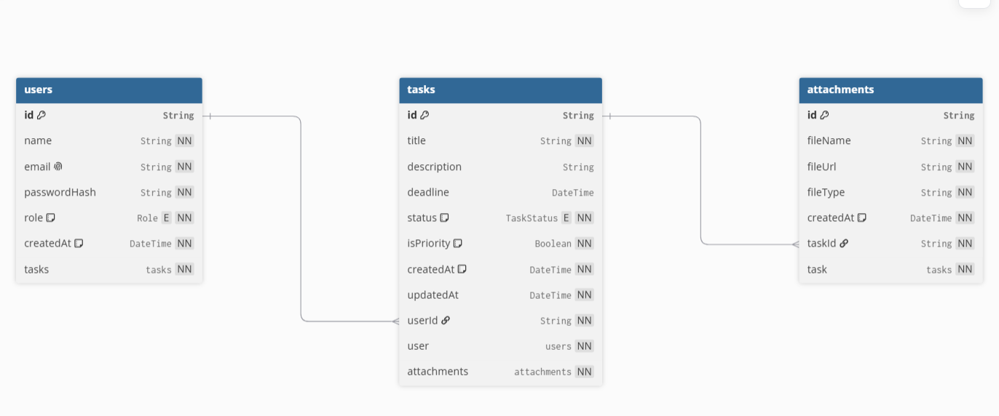

# ⚙️ Decisões Técnicas — Backend

Este documento apresenta as principais decisões arquiteturais, padrões de projeto e tecnologias adotadas no desenvolvimento da API do projeto.

---

# Arquitetura em Camadas (Layered Architecture)

A API foi desenvolvida seguindo o padrão **Layered Architecture**, promovendo uma separação clara de responsabilidades entre as diferentes partes da aplicação.

Além disso, a estrutura foi organizada por **módulos de domínio** (`auth`, `users`, `tasks` e `attachment`), permitindo que funcionalidades relacionadas permaneçam agrupadas e facilitando a manutenção e evolução do projeto.

## Fluxo de uma requisição

```text
HTTP Request
      │
      ▼
Middlewares
(Authentication, Authorization, Validation, Error Handling)
      │
      ▼
Controllers
(Recebem a requisição HTTP e retornam a resposta)
      │
      ▼
Services
(Contêm toda a regra de negócio)
      │
      ▼
Repositories
(Responsáveis pelo acesso ao banco de dados)
      │
      ▼
Prisma ORM
      │
      ▼
PostgreSQL
```

Cada camada possui uma responsabilidade específica:

| Camada | Responsabilidade |
|---------|------------------|
| **Middlewares** | Autenticação, autorização, validação e tratamento global de erros. |
| **Controllers** | Recebem as requisições HTTP, chamam os Services e retornam as respostas da API. |
| **Services** | Implementam toda a regra de negócio da aplicação. |
| **Repositories** | Centralizam o acesso ao banco de dados através do Prisma. |

---

# Repository Pattern

O acesso ao banco foi isolado através do **Repository Pattern**.

Essa abordagem desacopla completamente a regra de negócio da tecnologia de persistência utilizada.

Em vez de os Services utilizarem diretamente o Prisma, eles delegam essa responsabilidade aos Repositories.

## Benefícios

- Separação de responsabilidades.
- Código mais organizado.
- Facilidade para escrever testes.
- Facilidade para substituir o ORM futuramente.

Caso o Prisma seja substituído por outra solução (como TypeORM, Drizzle ou Kysely), apenas a camada de Repository precisará ser modificada, mantendo toda a lógica de negócio intacta.

---

# Modelagem de Dados

O banco de dados foi implementado utilizando **PostgreSQL** e **Prisma ORM**.

A escolha do Prisma foi motivada principalmente por sua excelente integração com o TypeScript, fornecendo tipagem estática durante todo o desenvolvimento e reduzindo erros em tempo de compilação.

O modelo relacional possui duas relações principais:

```text
Users (1) ────── (N) Tasks

Tasks (1) ────── (N) Attachments
```



## Integridade Referencial

Foi utilizada a estratégia:

```text
onDelete: Cascade
```

Com isso:

- ao excluir um usuário, todas as suas tarefas são removidas automaticamente;
- ao excluir uma tarefa, todos os seus anexos também são removidos.

Essa configuração mantém a consistência do banco e evita registros órfãos sem necessidade de lógica adicional na aplicação.

---

# Autenticação e Segurança

A autenticação utiliza **JWT (JSON Web Token)** através de uma estratégia híbrida composta por Access Token e Refresh Token.

## Access Token

- enviado no corpo da resposta do login;
- armazenado apenas em memória no frontend;
- curta duração (15 minutos).

---

## Refresh Token

- armazenado em **Cookie HttpOnly**;
- possui validade maior (7 dias);
- utilizado para restaurar automaticamente a sessão através da rota:

```text
GET /api/auth/me
```

Como o cookie é HttpOnly, ele não pode ser acessado por JavaScript, reduzindo significativamente riscos de ataques XSS.

---

## Cookie de Role

Além do Refresh Token, existe um cookie simples contendo apenas o papel do usuário:

```text
USER
```

ou

```text
ADMIN
```

Esse cookie não possui informações sensíveis e serve apenas para facilitar renderizações condicionais no frontend.

---

# Proteção de Rotas

Todas as rotas passam inicialmente pelo middleware `authGate`.

Ele verifica se a rota pertence ao conjunto de rotas públicas.

```ts
const PUBLIC_ROUTES: { method: string; path: string }[] = [
  { method: 'POST', path: '/users' },
  { method: 'POST', path: '/auth/login' },
  { method: 'GET', path: '/' },
  { method: "GET", path: "/auth/me" },
  { method: "POST", path: "/auth/logout" },
];
```

Caso a rota não seja pública, o middleware `auth` valida:

- existência do token;
- assinatura;
- expiração;
- identidade do usuário.

Após a validação, o middleware injeta na requisição:

- `userId`
- `userRole`

---

# Controle de Acesso

Para rotas que exigem permissões específicas foi desenvolvido o middleware genérico:

```ts
authorize(...roles)
```

Exemplo:

```ts
router.get(
  "/tasks",
  authorize("ADMIN"),
  TaskController.getAllTasks
);
```

Assim, apenas administradores podem acessar determinadas funcionalidades, enquanto usuários comuns ficam restritos aos próprios recursos.

---

# Docker

Toda a infraestrutura da aplicação foi containerizada utilizando Docker e Docker Compose.

Através de um único comando é possível iniciar:

- Backend
- PostgreSQL

```bash
docker compose up --build
```

## Benefícios

- ambiente padronizado;
- facilidade de instalação;
- elimina diferenças entre ambientes de desenvolvimento;
- simplifica a avaliação do projeto.

---

# Testes Automatizados

Foram implementados testes utilizando **Jest**, disponíveis na pasta `tests`.

Os testes cobrem funcionalidades essenciais da API e auxiliam na prevenção de regressões durante futuras alterações.

## Benefícios

- maior confiabilidade;
- facilidade de refatoração;
- validação automática das principais regras de negócio.

---

← [**Voltar para o documento de Decisões Gerais**](/server/docs/decisions.md)